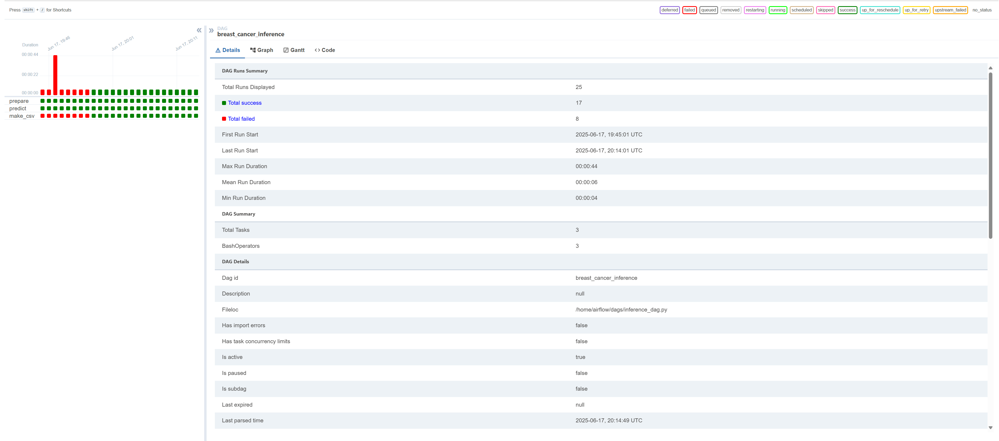

# Breast Cancer Diagnostic Inference Pipeline

## Содержание

1. [Введение](#введение)
2. [Цель проекта](#цель-проекта)
3. [Архитектура и схема](#архитектура-и-схема)
4. [Описание шагов пайплайна](#описание-шагов-пайплайна)
5. [Запуск и развертывание](#запуск-и-развертывание)
6. [Идеи по улучшению](#идеи-по-улучшению)

---

## Введение

Проект посвящен автоматизации полного ML-пайплайна для диагноза рака молочной железы на основе датасета Breast Cancer Wisconsin Diagnostic. Используются инструменты:

* **Python** для разработки ETL-скриптов и модели
* **scikit-learn**, **CatBoost**, **XGBoost**, **LightGBM** для обучения и предсказания
* **Apache Airflow** для оркестрации задач

## Цель проекта

* **Автоматизировать** процесс от загрузки сырых медицинских данных до получения финального CSV с предсказаниями.


## Архитектура и схема

```text
┌─────────────┐    ┌───────────────┐    ┌───────────────────────┐
│ Загрузка csv│ -> │  Предобработка│ -> │Исследование признаков │
└─────────────┘    └───────────────┘    └───────────────────────┘
                                             ↓
                                        ┌────────────────────┐
                                        │ Построение модели  │
                                        └────────────────────┘
                                             ↓
                                        ┌─────────────────────────────────────────┐
                                        │ Вывод в продакшн и оркестрация процессов│
                                        └─────────────────────────────────────────┘
```

* **01\_prepare.py**: очистка данных и сохранение признаков
* **02\_predict.py**: загрузка моделей, отбора признаков и классификатора
* **03\_make\_csv.py**: объединение id и предсказаний в итоговый CSV
* **DAG**: оркестрация в Airflow (`breast_cancer_inference`)

## Описание шагов пайплайна

1. **Предобработка** (`PrepareData`, `01_prepare.py`)

   * Загрузка CSV
   * Переименование колонок
   * Кодирование целевой метки

2. **Отбор признаков** (`Selector`)

   * Отбор признаков при помощи RFE и Случайного леса

3. **Обучение моделей**

    * Были обучены несколько моделей, наилучшей оказался Ансамбль из catboost,xgboost, randomforest и KNN

    * Метрика f1 на кросс-валидации получилась 0.97

    * В дальнейшем я не стал постоянно обучать довольно ресурснозатратную модель, поэтому я просто сохранил веса модели


3. **Predict** (`FinalModel`, `02_predict.py`)

   * Загрузка обученной модели (VotingClassifier)
   * Генерация вероятностей (predict\_proba)

4. **Submission** (`03_make_csv.py`)

   * Чтение id и proba из файлов
   * Формирование результирующего DataFrame
   * Сохранение с меткой времени в папку `results/`

---

## Анализ ошибок и устойчивости

    * Если структура подаваемых данных изменится, то модель не сможет предсказать метку и соотвественно весь продакшн упадет.

    * Все путь к файлам и дагам я задавал вручную, соотвественно важно всегда проверять пути, которые прописаны в дагах, поскольку весь процесс оркестрации может упасть с ошибкой


## Результат

Вывод: Таким образом мы предобработали наши данные, исследовали ( см jupyter noyebook), а также отобрали признаки и обучили классификатор. Затем мы все наши шаги оркестрировали при помощи Airflow

**Скриншот рабочего дага** 


